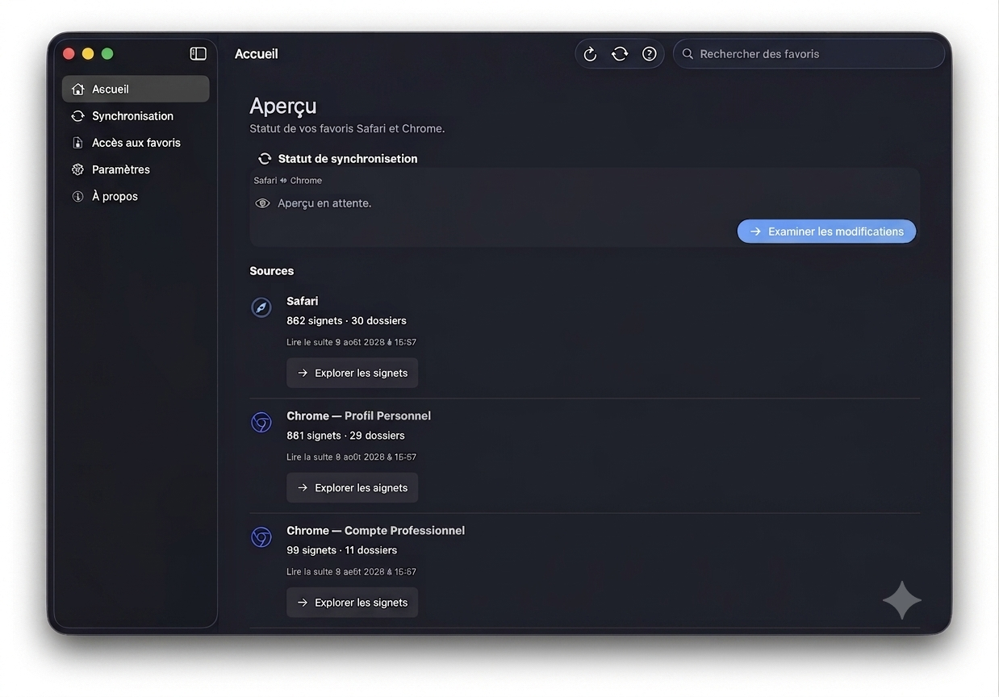
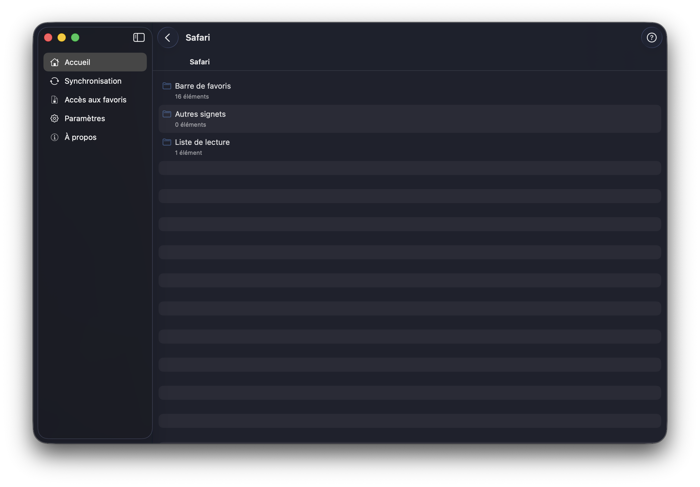
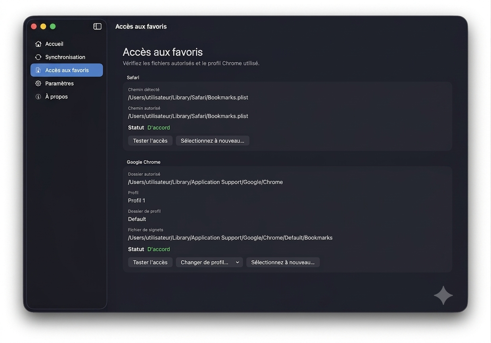
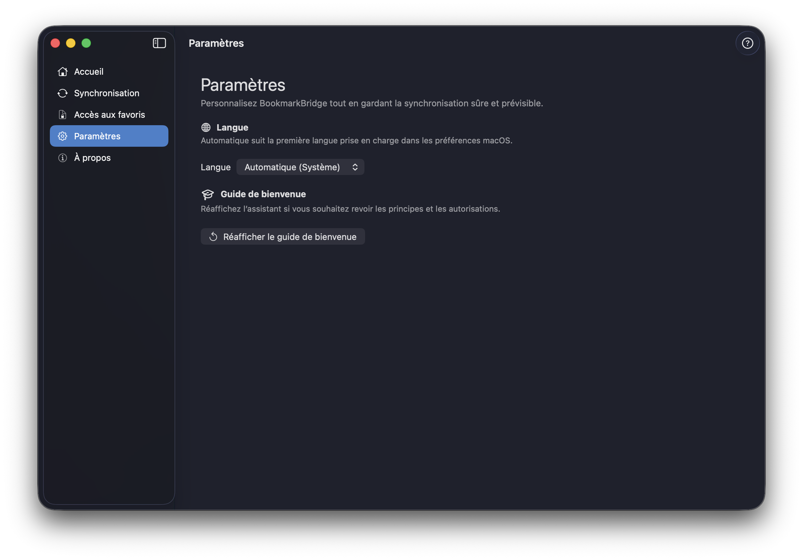
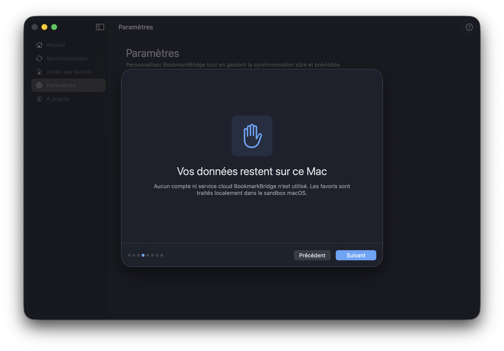

<div align="center">
  

# BookmarkBridge

**Reliez vos favoris Safari et Google Chrome avec un workflow local adapté à chaque direction.**

[](https://bookmarkbridge.fr)
[](https://www.swift.org/)
[](https://bookmarkbridge.fr/download.html)
[](LICENSE)

### [🌐 Site officiel — bookmarkbridge.fr](https://bookmarkbridge.fr)

[Télécharger la bêta](https://bookmarkbridge.fr/download.html) · [Workflow 0.9.4](#première-synchronisation) · [FAQ](https://bookmarkbridge.fr/#faq) · [Discussions](https://github.com/JRMHDCK/BookmarkBridge/discussions)
</div>

> [!IMPORTANT]
> BookmarkBridge 0.9.4 Beta est un logiciel bêta distribué gratuitement. Vérifiez toujours l’aperçu avant une synchronisation et conservez des sauvegardes de vos navigateurs. Cette version n’est pas encore signée ni notariée par Apple.

## Présentation

BookmarkBridge est une application macOS native en SwiftUI qui compare les bibliothèques de favoris de Safari et de Google Chrome, présente les changements proposés, puis utilise le workflow le plus sûr pour la direction choisie.

L’application est conçue autour d’un principe simple : vos favoris doivent rester **compréhensibles, récupérables et sous votre contrôle**. Le traitement est local, sans compte BookmarkBridge, sans analytique et sans synchronisation cloud.

## Fonctionnalités

- écriture transactionnelle **Safari → Chrome**, avec sauvegarde et restauration en cas d’échec ;
- préparation d’un import HTML additif **Chrome → Safari**, appliqué par Safari sans écriture directe de `Bookmarks.plist` ;
- aperçu détaillé avant toute modification ;
- détection des créations, suppressions, déplacements, renommages et mises à jour, avec signalement des opérations incompatibles avec l’import Safari ;
- exploration hiérarchique, fil d’Ariane et recherche multi-sources ;
- découverte des profils Chrome locaux ;
- sauvegardes horodatées pour les écritures transactionnelles ;
- protections contre les écritures concurrentes lorsque les navigateurs sont ouverts ;
- historique des synchronisations et informations d’audit ;
- assistant de première ouverture, aide intégrée, FAQ et guide hors ligne ;
- application native SwiftUI, compatible Apple Silicon et Intel 64 bits.

## Captures

<div align="center">
  
  <p><em>Vue d’ensemble des bibliothèques locales.</em></p>
</div>

<div align="center">
  
  
</div>

<div align="center">
  
  
</div>

L’interface suit les conventions de macOS et prend en charge les apparences claire et sombre. Les données visibles dans ces captures ont été anonymisées.

## Télécharger et installer

### Prérequis

- macOS 26.5 ou version ultérieure ;
- Safari et/ou Google Chrome ;
- Mac Apple Silicon ou Intel 64 bits.

### Installation du DMG

1. [Téléchargez BookmarkBridge gratuitement](https://bookmarkbridge.fr/download.html).
2. Ouvrez `BookmarkBridge-0.9.4-build-1.dmg`.
3. Glissez `BookmarkBridge.app` sur le raccourci `Applications`.
4. Éjectez l’image disque.
5. Ouvrez BookmarkBridge depuis le dossier Applications.

Gatekeeper peut bloquer la première ouverture car la bêta n’est pas encore notariée. Le [guide illustré de téléchargement](https://bookmarkbridge.fr/download.html) explique comment ouvrir **Réglages Système > Confidentialité et sécurité**, puis utiliser **Ouvrir quand même**, sans désactiver Gatekeeper.

- [Page de téléchargement et guide Gatekeeper](https://bookmarkbridge.fr/download.html)
- [DMG direct](https://bookmarkbridge.fr/downloads/BookmarkBridge-0.9.4-build-1.dmg)
- [Somme SHA-256](https://bookmarkbridge.fr/downloads/SHA256.txt)
- [Workflow de synchronisation 0.9.4](#première-synchronisation)
- [Notes de version](Documentation/RELEASE_NOTES_0.9.4-beta.md)

## Première synchronisation

1. Accordez uniquement les accès Safari et Chrome nécessaires.
2. Chargez les bibliothèques de favoris.
3. Choisissez le navigateur source et le navigateur cible.
4. Examinez chaque changement dans l’aperçu.
5. Suivez le workflow indiqué pour la direction choisie.

### Safari → Chrome

Fermez Chrome lorsque BookmarkBridge le demande, puis confirmez. L’application sauvegarde la cible et applique la transaction directement.

### Chrome → Safari

BookmarkBridge prépare uniquement les nouveaux favoris importables dans un fichier HTML. Ouvrez Safari puis choisissez **Fichier → Importer depuis → Fichier HTML de signets**. Les suppressions, déplacements, renommages et changements d’URL sont signalés, mais ne peuvent pas être appliqués par cet import additif.

BookmarkBridge utilise l’App Sandbox et des autorisations persistantes `security-scoped`. Il ne faut pas désactiver la sandbox pour contourner un problème d’accès.

## Documentation

- [FAQ en ligne](https://bookmarkbridge.fr/#faq)
- [Notes de version 0.9.4 Beta](Documentation/RELEASE_NOTES_0.9.4-beta.md)
- [Limitations connues](Documentation/KNOWN_ISSUES.md)
- [État du projet](Documentation/PROJECT_STATUS.md)
- [Architecture](Docs/ARCHITECTURE.md)
- [Décisions d’architecture](Docs/adr/)
- [Construction du DMG](Distribution/DMG/README.md)
- [Plateforme QA](QA/Documentation/README.md)

## Construire depuis les sources

Ouvrez `BookmarkBridge.xcodeproj` dans Xcode 26.5 ou utilisez le Terminal :

```sh
xcodebuild build \
  -project BookmarkBridge.xcodeproj \
  -scheme BookmarkBridge \
  -configuration Debug \
  -destination 'platform=macOS'
```

Le projet utilise Swift 6 et ne dépend d’aucune bibliothèque tierce.

Pour lancer les tests unitaires :

```sh
xcodebuild test \
  -project BookmarkBridge.xcodeproj \
  -scheme BookmarkBridge \
  -destination 'platform=macOS' \
  -only-testing:BookmarkBridgeTests
```

La suite UI nécessite une session graphique macOS active. Les tests utilisent des fixtures isolées et ne lisent ni ne modifient les vrais favoris de l’utilisateur.

## Architecture

BookmarkBridge suit une architecture MVVM avec des dépendances orientées vers de petits protocoles :

```text
SwiftUI Views → ViewModels → Core protocols ← Services et repositories
```

- `BookmarkBridge/App/` — point d’entrée et composition des dépendances ;
- `BookmarkBridge/Core/` — modèles, parseurs, moteur de synchronisation, sécurité et accès navigateurs ;
- `BookmarkBridge/Features/` — fonctionnalités SwiftUI et état de présentation ;
- `BookmarkBridge/Shared/` — composants d’interface réutilisables ;
- `BookmarkBridgeTests/` — tests unitaires et d’intégration ;
- `BookmarkBridgeUITests/` — parcours utilisateur critiques ;
- `QA/` — jeux de données, scénarios et outils de validation ;
- `Distribution/` — génération du DMG, kit GitHub et site statique.

## Feuille de route

- recueillir les retours de la bêta 0.9.x et corriger les défauts confirmés ;
- renforcer la compatibilité avec différentes structures de bibliothèques ;
- signer et notarier l’application avec Apple Developer ;
- stabiliser l’expérience et la documentation avant la version 1.0 ;
- étudier d’autres navigateurs après la stabilisation de Safari et Chrome.

Les idées et priorités peuvent être discutées dans [GitHub Discussions](https://github.com/JRMHDCK/BookmarkBridge/discussions).

## Contribuer

> **BookmarkBridge est mon premier projet open source. Les retours, suggestions et contributions bienveillantes sont les bienvenus.**

Avant de contribuer, consultez le [guide de contribution](CONTRIBUTING.md) et le [Code de conduite](CODE_OF_CONDUCT.md). Les changements doivent préserver les garanties de sécurité des données et inclure des tests lorsqu’ils modifient un comportement.

- [Signaler un bug ou proposer une amélioration](https://github.com/JRMHDCK/BookmarkBridge/issues)
- [Poser une question ou partager une idée](https://github.com/JRMHDCK/BookmarkBridge/discussions)

## Sécurité

Ne publiez pas une vulnérabilité dans une issue publique. Suivez les instructions de [SECURITY.md](SECURITY.md) pour utiliser le canal de signalement privé de GitHub lorsqu’il est disponible.

## Licence

BookmarkBridge est distribué sous [licence MIT](LICENSE).

Copyright © 2026 Jérôme Hudeček.
